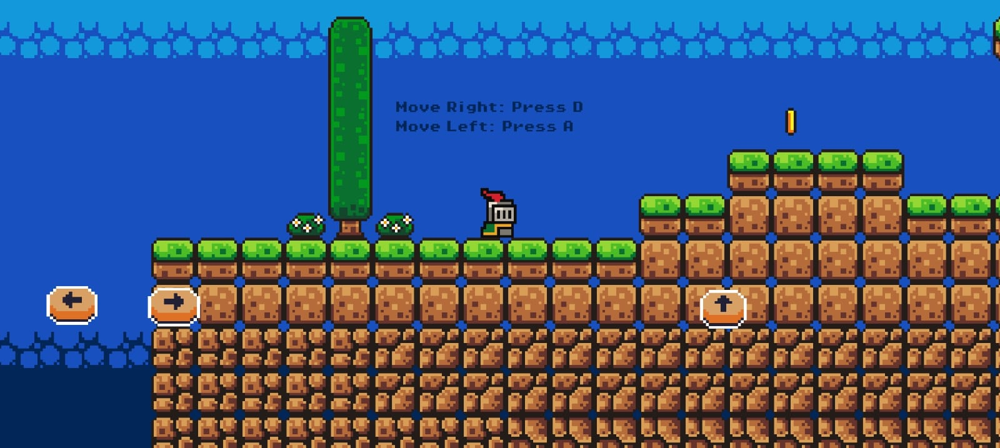
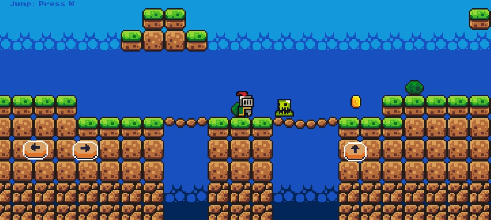
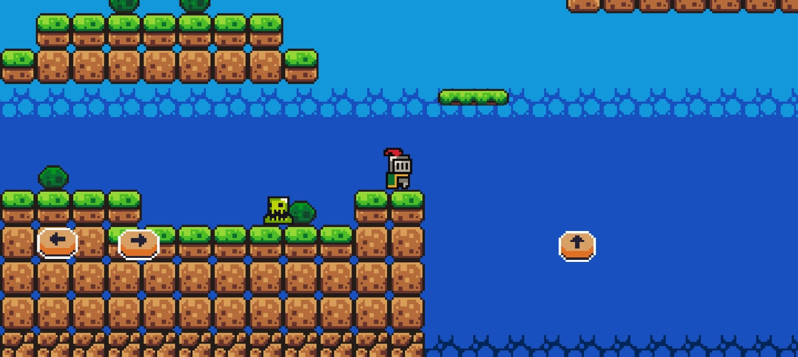

🎮 2D Platformer Game

A 2D platformer game built using Godot Engine and GDScript, then exported for Android using Android Studio. This project was created to improve my game development skills and demonstrate core platformer mechanics, including player movement, animations, enemy interactions, and level progression.

✨ Features

- Smooth player movement
- Jumping mechanics
- Enemy interactions
- Collectibles
- Animations
- Multiple levels
- Collision detection and physics
- Android support

🛠️ Technologies Used

- Godot Engine
- GDScript
- Android Studio (Android export)
- Git & GitHub

📸 Screenshots

  

 

    

 

🚀 Getting Started

1. Clone the repository.
2. Open the project in Godot Engine.
3. Run the project or export it for your preferred platform.

📱 Android

The game is configured for Android deployment and can be exported using Android Studio.

🎯 Purpose

This project is part of my App development portfolio and demonstrates my understanding of App development, gameplay programming, physics, animations, scene management, and Android deployment.
